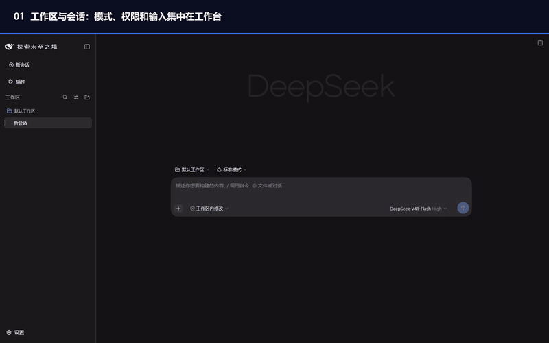

# DeepSeek Harness (0.1)

[English](README.md) | 中文

**DeepSeek Harness（`dsh`）** 是一个开源、基于插件组合的 AI 智能体运行环境，提供 Web 应用和 Electron 桌面应用。

**0.1** 版本仍处于开发者预览阶段。执行模型任务需要配置服务商和 API Key；应用 API 可能继续变化。

## 观看项目介绍

[](https://github.com/2671321688-tech/deepseek-harness/releases/download/v0.1.0/deepseek-harness-project-tour.mp4)

[观看 31 秒项目介绍视频（MP4，0.7 MB）](https://github.com/2671321688-tech/deepseek-harness/releases/download/v0.1.0/deepseek-harness-project-tour.mp4)

视频录制自本地 Web 应用，其应用界面也由 Electron 桌面端使用。视频展示实际配置与导航，没有模拟 AI 回答或账户余额。

---

## 0.1 应用界面展示

- **工作区与会话：** 选择工作区，创建或打开会话，并在输入框附近选择模式与执行权限。
- **模型配置：** 选择模型和推理强度，在设置中配置 DeepSeek API Key 或添加自定义服务商。
- **插件管理：** 查看可用插件，在应用中配置终端等工具。
- **智能体预设：** 选择 Standard、PTC、Minimal、Creator 四种组合。
- **外观与交互：** 切换浅色和深色主题，调整通用交互设置。

---

## 📦 跨平台应用下载 (v0.1)

我们为所有主流桌面操作系统提供了独立打包的可执行应用：

| 操作系统 | 格式与下载链接 | 文件名 | 架构与体积 |
| :--- | :--- | :--- | :--- |
| **Windows** | [📥 便携绿色免安装版 (.zip)](https://github.com/2671321688-tech/deepseek-harness/releases/download/v0.1.0/DeepSeek-Harness-0.1.0-win-x64.zip) | `DeepSeek-Harness-0.1.0-win-x64.zip` | Windows x64 (162 MB) |
| **macOS** | [📥 完整应用归档 (.zip)](https://github.com/2671321688-tech/deepseek-harness/releases/download/v0.1.0/DeepSeek-Harness-0.1.0-mac-arm64.zip) | `DeepSeek-Harness-0.1.0-mac-arm64.zip` | Apple Silicon M1-M4 (132 MB) |
| **Linux** | [📥 免安装包 (.tar.gz)](https://github.com/2671321688-tech/deepseek-harness/releases/download/v0.1.0/DeepSeek-Harness-0.1.0-linux-x64.tar.gz) / [📥 Zip包](https://github.com/2671321688-tech/deepseek-harness/releases/download/v0.1.0/DeepSeek-Harness-0.1.0-linux-x64.zip) | `DeepSeek-Harness-0.1.0-linux-x64.tar.gz` | Linux x64 (124 MB) |

> 💡 **提示**：您可以在 [GitHub Releases 页面](https://github.com/2671321688-tech/deepseek-harness/releases) 查看完整变更日志与校验哈希值。

---

<a id="run"></a>

## 🛠️ 从源码构建与开发

### 环境要求
- **Node.js**: `>= 22.19.0`
- **pnpm**: `11.7.0`
- **Python**: `>= 3.10`（仅在使用本地 Python 运行扩展时需要）

<a id="run-from-source"></a>

### 快速启动

1. **克隆代码库**：
   ```bash
   git clone git@github.com:2671321688-tech/deepseek-harness.git
   cd deepseek-harness
   ```

2. **安装依赖**：
   ```bash
   pnpm install
   ```

3. **构建基础产物**：
   ```bash
   pnpm run build
   pnpm run build:desktop
   ```

4. **启动桌面端开发调试**：
   ```bash
   pnpm run dev:desktop
   ```

### 独立打包应用

在项目根目录下或进入 `apps/desktop`，执行下列命令即可生成对应平台的发布二进制：

```bash
pnpm --filter @deepseek-ai/dsh-desktop run dist:win

pnpm --filter @deepseek-ai/dsh-desktop run dist:mac

pnpm --filter @deepseek-ai/dsh-desktop run dist:linux
```

打包产物将自动输出到 `apps/desktop/dist-release/` 目录下。

---

## 🤝 参与贡献与社区

- **Issue 与反馈**：欢迎通过 [GitHub Issues](https://github.com/2671321688-tech/deepseek-harness/issues) 提交改进建议；
- **安全说明**：请参阅 [SAFETY.zh.md](SAFETY.zh.md)；
- **代码规范**：请遵循 [CONTRIBUTING.zh.md](CONTRIBUTING.zh.md)。

---

## 📄 开源许可证

本项目基于 [MIT License](LICENSE) 开源。
